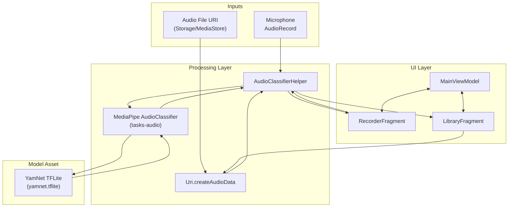

# MediaPipe Audio Classifier Android Demo — Internals

## Architecture Snapshot
- `MainActivity` inflates the root layout, attaches the bottom navigation to a shared navigation graph, and exposes a single `MainViewModel` instance so classifier parameters survive screen changes (`MainActivity.kt:30`, `nav_graph.xml:5`, `MainViewModel.kt:23`).
- Live capture is handled by `RecorderFragment`, which instantiates `AudioClassifierHelper` in streaming mode on a background executor. MediaPipe supplies an `AudioRecord` configured for 16 kHz input; scheduled inference windows are dispatched with user-controlled overlap, and callback results update observers on the main thread (`RecorderFragment.kt:80`, `AudioClassifierHelper.kt:86`, `AudioClassifierHelper.kt:112`, `RecorderFragment.kt:224`).
- Library-based classification flows through `LibraryFragment`. It rebuilds the helper for clip mode, classifies the selected file synchronously, then replays the audio while iterating over the returned windowed results (`LibraryFragment.kt:49`, `LibraryFragment.kt:119`, `LibraryFragment.kt:152`, `LibraryFragment.kt:198`).
- `ProbabilitiesAdapter` renders category outputs, while the bottom-sheet controls in both fragments persist their state through `MainViewModel`, keeping configuration for score threshold, max results, and overlap in sync (`ProbabilitiesAdapter.kt:33`, `RecorderFragment.kt:140`, `LibraryFragment.kt:223`).
- The YamNet model is bundled under `app/src/main/assets/yamnet.tflite` and downloaded automatically before builds; an instrumentation test validates expected labels on a sample audio clip (`download_model.gradle:1`, `AudioClassifierHelperTest.kt:52`, `AudioClassifierHelperTest.kt:64`).

## Architecture Diagram

## Model Pipeline
- `AudioClassifierHelper` constructs the MediaPipe task using the YamNet asset and applies the chosen `RunningMode`. Stream mode additionally registers `ResultListener` and `ErrorListener` so MediaPipe can push inference outputs asynchronously (`AudioClassifierHelper.kt:56`, `AudioClassifierHelper.kt:68`, `AudioClassifierHelper.kt:75`).
- Core audio parameters match the YamNet task requirements: mono audio at 16 kHz with a receptive field of 0.975 s. Buffer sizing is derived from `SAMPLING_RATE_IN_HZ` and `EXPECTED_INPUT_LENGTH` to guarantee each invocation receives the expected frame length (`AudioClassifierHelper.kt:199`, `AudioClassifierHelper.kt:202`).

### Asset Lifecycle
- Gradle’s `downloadYamnetModel` task retrieves the YamNet TFLite artifact into `app/src/main/assets/yamnet.tflite` before every build (`download_model.gradle:1`). Because it sits in `src/main/assets`, the file is bundled automatically into the APK/AAB asset table.
- At runtime, `AudioClassifierHelper` points MediaPipe to that packaged asset by calling `BaseOptions.builder().setModelAssetPath(YAMNET_MODEL)` with `YAMNET_MODEL = "yamnet.tflite"` (`AudioClassifierHelper.kt:56`, `AudioClassifierHelper.kt:194`). The task runtime resolves the asset name via Android’s `AssetManager`, memory-maps the model, and initializes `AudioClassifier.createFromOptions`.
- Once `AudioClassifier` is instantiated, all inference (both streaming and clip) uses the loaded model handle directly; no further filesystem access is needed during classification (`AudioClassifierHelper.kt:82`, `AudioClassifierHelper.kt:147`).

### Inference Runtime
- TensorFlow Lite is Google’s lightweight inference engine for running trained TensorFlow models on-device. It provides optimized kernels for mobile/embedded CPUs and optional delegates (GPU, NNAPI) so apps can execute neural networks without a server round-trip, making it the execution core beneath MediaPipe Tasks.
- MediaPipe Tasks are a thin orchestration layer on top of TensorFlow Lite. When `AudioClassifier.createFromOptions` is invoked, the Tasks library: (1) creates a TFLite interpreter for `yamnet.tflite`, (2) configures it with task-specific pre/post-processing graphs (e.g., waveform-to-spectrogram feature extraction, label filtering), and (3) wires in optional callbacks so host code can receive `AudioClassifierResult` objects without touching the interpreter directly (`AudioClassifierHelper.kt:82`).
- Because `BaseOptions.Builder.setDelegate(...)` is never used here, MediaPipe instantiates the interpreter with the default CPU delegate provided by the Android TFLite runtime. Switching to GPU or NNAPI would require explicitly setting `Delegate.GPU` or `Delegate.NNAPI` on the `BaseOptions` builder before `createFromOptions` is called (`AudioClassifierHelper.kt:32`, `AudioClassifierHelper.kt:68`).
- In streaming mode, the helper’s `ScheduledThreadPoolExecutor` drives when frames are submitted, but TensorFlow Lite execution runs on a MediaPipe-managed worker thread. That worker performs the audio feature pipeline, runs inference, packages the probabilities into `Category` objects, and posts them back through the registered `ResultListener` so UI code never manipulates interpreter buffers directly.

### Input Acquisition and Preprocessing
- **Streaming audio**: When the helper runs in `RunningMode.AUDIO_STREAM`, `createAudioRecord()` produces an `AudioRecord` tied to the task. Each scheduled tick wraps the current PCM frame in an `AudioData` container using `AudioDataFormat.create(recorder!!.getFormat())`, letting the task library handle required conversions before inference (`AudioClassifierHelper.kt:86`, `AudioClassifierHelper.kt:138`).
- **File-based audio**: `Uri.createAudioData` reads the selected media into a little-endian `ShortArray`, extracts duration metadata via `MediaMetadataRetriever`, infers a sample rate that keeps the 0.975 s window size consistent, and loads the PCM buffer into `AudioData` (`Extentions.kt:12`, `Extentions.kt:27`, `Extentions.kt:31`).

### Execution Flow
- **Streaming**: The helper computes an execution cadence from the overlap parameter and schedules `classifyRunnable` on a `ScheduledThreadPoolExecutor`. Each iteration timestamps the frame and invokes `AudioClassifier.classifyAsync`, leaving MediaPipe to queue work and call the registered listener with results (`AudioClassifierHelper.kt:125`, `AudioClassifierHelper.kt:129`, `AudioClassifierHelper.kt:143`, `AudioClassifierHelper.kt:175`).
- **Clip mode**: `AudioClassifier.classify` executes synchronously on the supplied `AudioData`. The helper measures inference latency and wraps the single `AudioClassifierResult` in a `ResultBundle` before returning to the caller (`AudioClassifierHelper.kt:147`, `AudioClassifierHelper.kt:152`).

### Output Handling
- Each inference yields an `AudioClassifierResult`, which contains a list of `ClassificationResult` objects. The helper’s `ResultBundle` records those results plus the measured inference time and emits them via the `ClassifierListener` interface (`AudioClassifierHelper.kt:147`, `AudioClassifierHelper.kt:188`).
- Consumers either implement `ClassifierListener.onResult` (streaming) or inspect the returned bundle from `classifyAudio` (clip). In both cases, downstream code reads class names, confidence scores, and indices directly from `Category` objects supplied by MediaPipe without additional post-processing (`RecorderFragment.kt:224`, `LibraryFragment.kt:152`, `ProbabilitiesAdapter.kt:54`).

## Further Reading
- TensorFlow Lite integration details: [TensorFlowLite.md](TensorFlowLite.md)
- MediaPipe concepts and resources: [MediaPipe.md](MediaPipe.md)
